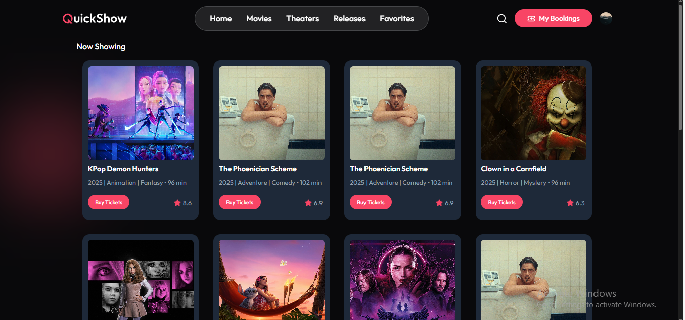
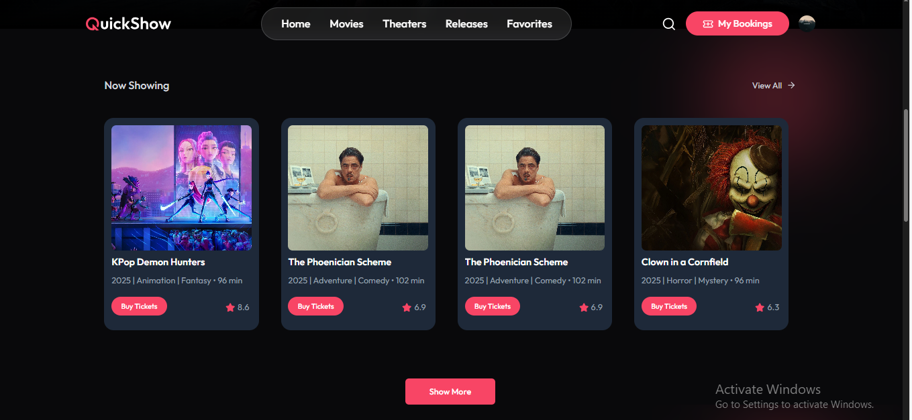
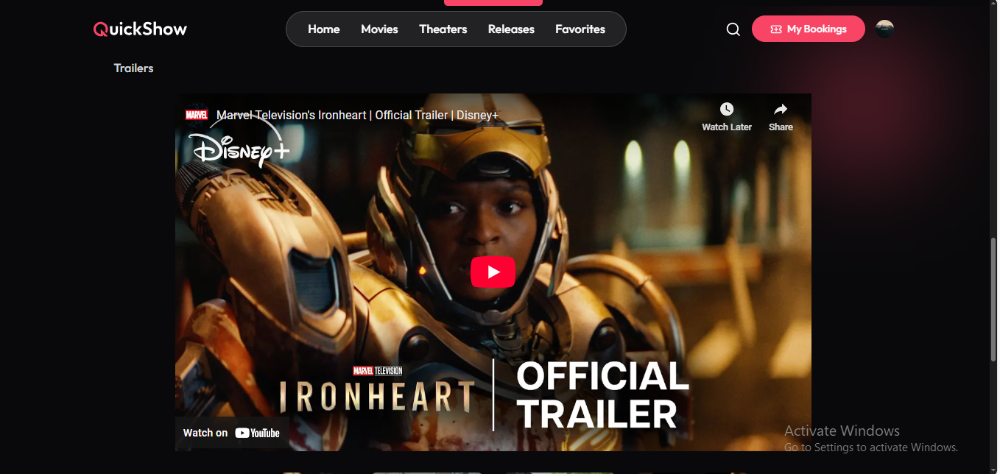
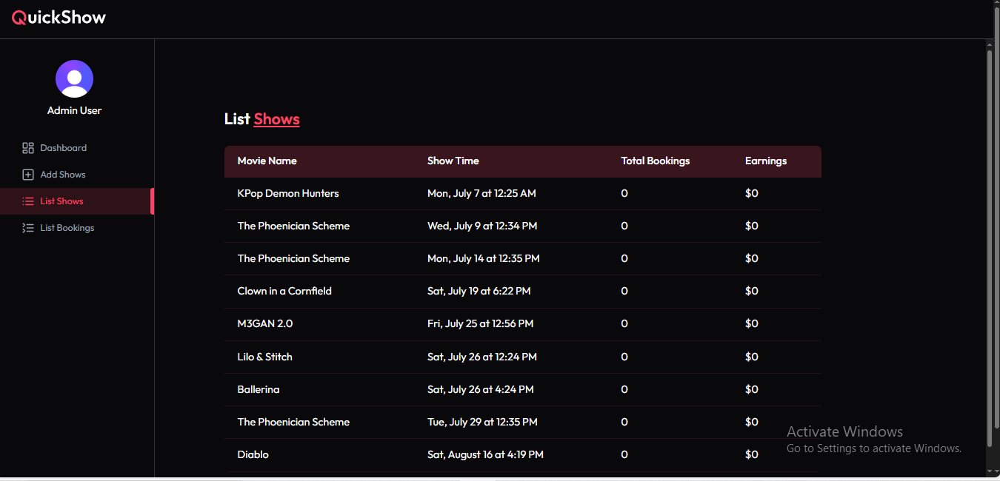

# 🎬 Quick Movies

Quick Movies is a full-stack movie ticket booking platform that allows users to browse movies, choose showtimes, select seats, and book tickets online.

This project is built with the **MERN stack** and features **Clerk authentication**, seat availability logic, and a modern, responsive UI.

## 🛠 Tech Stack

### Frontend
- React.js
- React Router v6
- Tailwind CSS
- Axios
- Day.js
- Lucide Icons
- React Hot Toast
- Clerk (for authentication)

### Backend
- Node.js
- Express.js
- MongoDB + Mongoose
- Clerk (Express middleware)
- Stripe (optional for payment integration)

## 🔑 Features

- ✅ User authentication with Clerk
- 🎥 Movie and show listings with timing slots
- 📅 Filter by date & time
- 🎟️ Seat selection (with max limit of 5)
- 🔐 Block already occupied seats
- 📦 Store bookings in MongoDB
- 👤 My Bookings page to view confirmed tickets
- 🔄 Realtime seat availability checks

🔐 Environment Variables
Backend (server/.env)
env
Copy
Edit
MONGO_URI=your_mongodb_connection_uri
CLERK_SECRET_KEY=your_clerk_backend_jwt_key
TMDB_API_KEY=your_tmdb_api_key
Frontend (client/.env)
env
Copy
Edit
VITE_CLERK_PUBLISHABLE_KEY=your_clerk_publishable_key

🌟 Future Enhancements
💳 Stripe payment gateway integration

🎫 Admin dashboard for managing shows

🔍 Movie filtering and search

📱 Fully mobile-responsive improvements

## 📸 Screenshots

### 🎬 Homepage

### 🎟️ Now Showing

### 📂 Show More

### 📂 Trailer page

### 📂 Admin Panel

